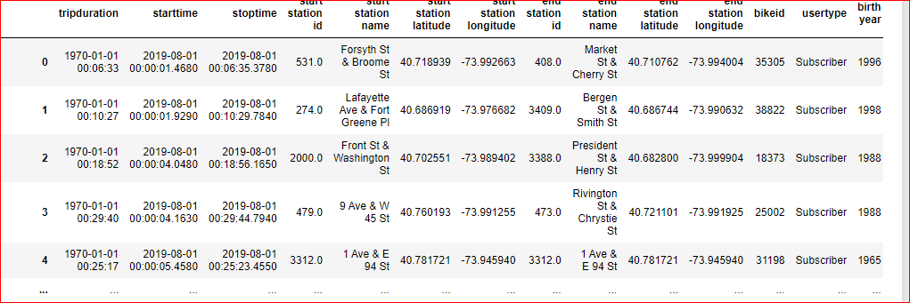
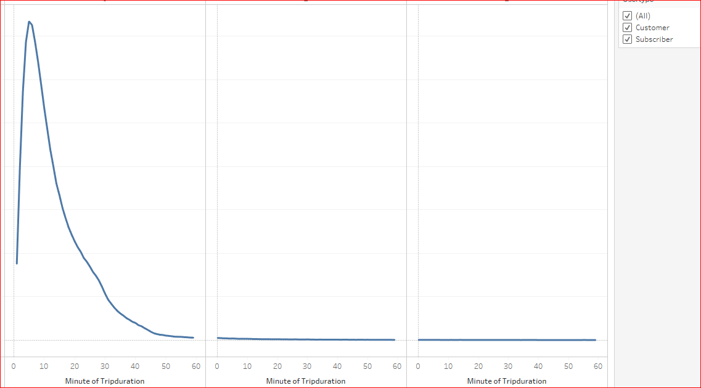
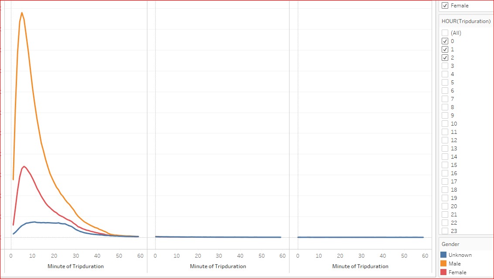
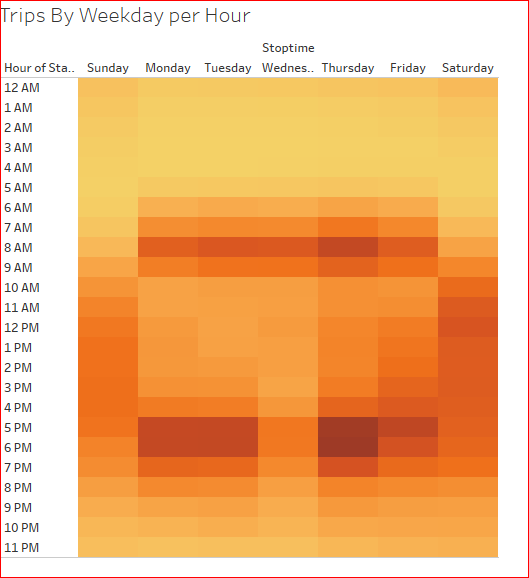
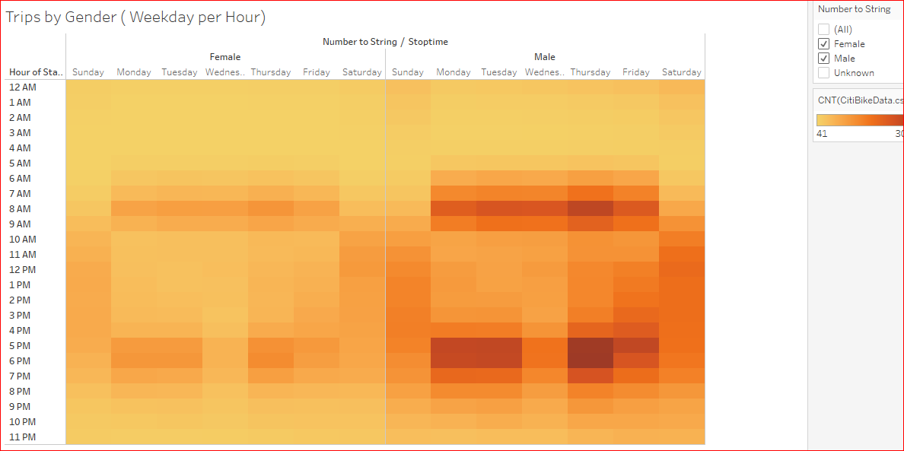
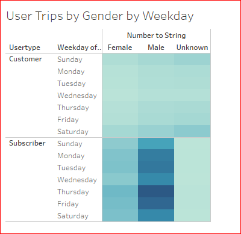
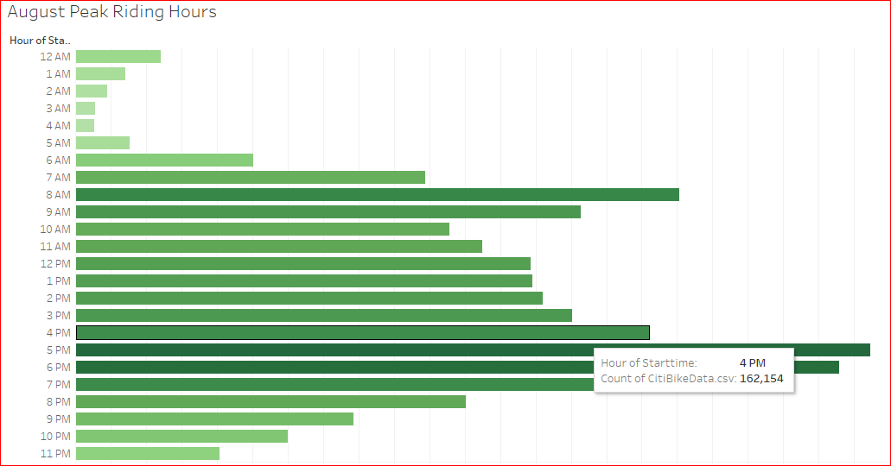
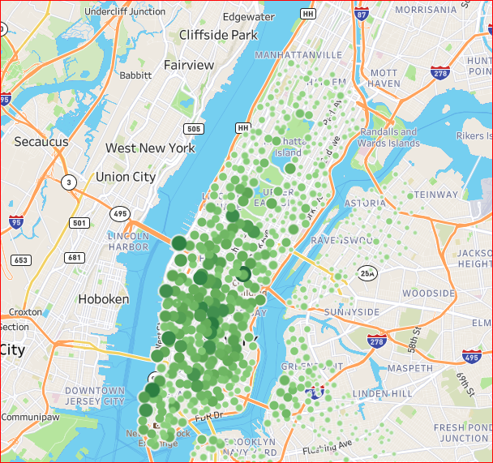

# NY Citi Bike Program 
## Overview of the challenge:
Convince the investors that bike sharing program in Des Moines is a solid business proposal. Created visualization to back up the proposal. 

## Change Trip Duration:
Using Pandas dataframe converted the trip duartion from integer to date format.

## Length of time bikes checked out :
* Created graph to show the length of time that bikes are checked out for all riders. 

By gender .

## Number of bike trips for each hour :
* The number of bike trips for all riders for each hour of each day of the week.

By gender.

## Create the User Trips by Gender by Weekday:

## From Module
 * created the peak time bar chart for the bike ride.
 

 ## Created the staring point for the bike ride.
 

 ## Link to the story board
 [Link to StoryBoard](https://public.tableau.com/app/profile/uma.iyer/viz/NYCitiBike_16475682530180/NYCityBike?publish=yes)

